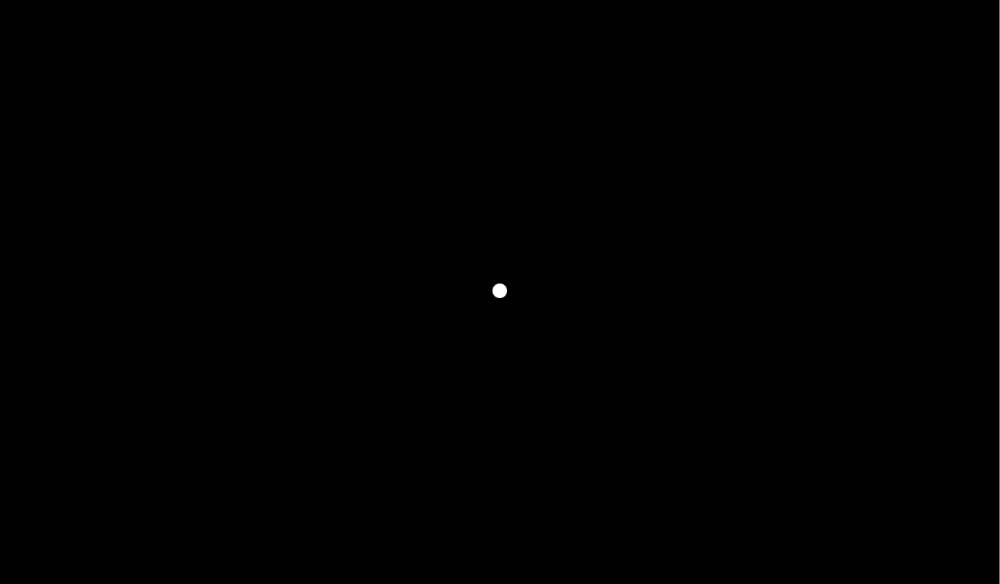
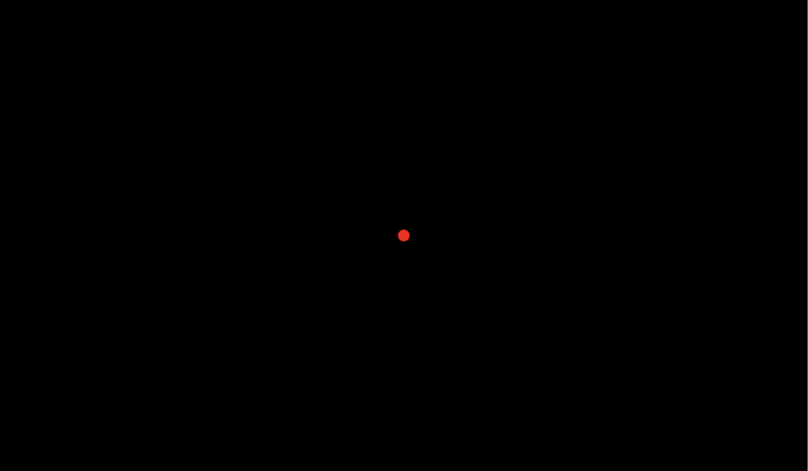
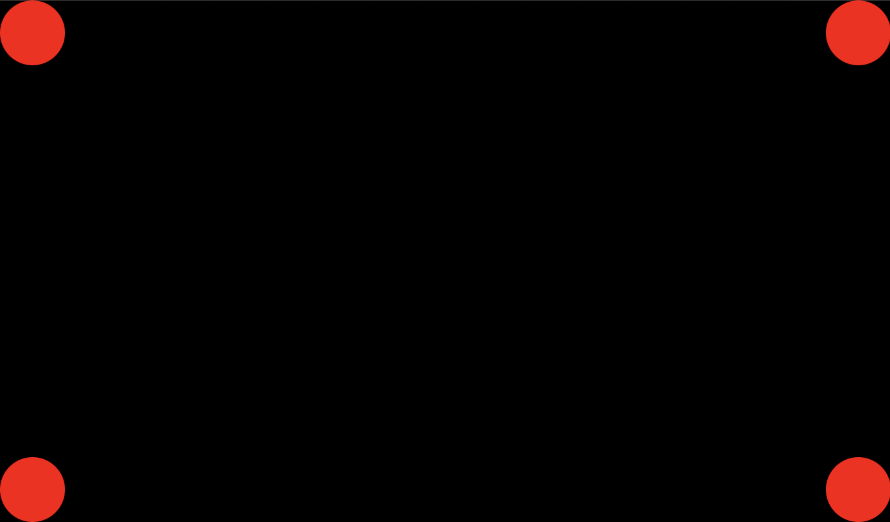

# prairie-particules

Welcome to the fascinating world of particle generators! Before diving into the steps, let's understand what we are aiming to build and why it matters.

A particle generator, as the name implies, is a system that creates and manages numerous tiny graphics called particles. These particles, when combined, can create mesmerizing effects like smoke, fire, stars, and many more dynamic visuals. By learning how to develop a particle generator, not only will you hone your skills in manipulating graphics on a canvas, but you'll also unlock the potential to create interactive and visually appealing web applications.

We'll be using the CanvasRenderingContext2D API, a powerful tool within the HTML5 Canvas, to create our generator. This API allows us to draw graphics on the fly, making it perfect for our project. Whether you're an aspiring game developer, a budding web designer, or just curious about how such visuals come to life, this guide is the perfect starting point.

Ready to embark on this creative journey? Let's dive in!

In this repo you'll find a pre-configured dev enviromnent created using [vite](https://vitejs.dev).

**Use git**: I highly recommend you to use git for this project. For instance once you complete one step commit your work by using a meaningful commit message like `Step 1: completed`.

## Step 0: start the dev server

To start the dev server, execute the following command:

```bash
npm run dev
```

Then open you browser using the link displayed in your terminal. Should be http://localhost:5174/ .

You should see a black page with a white dot.


## Step 1: Modify the color

**Objective**: Learn how to customize the appearance of elements on the canvas.

**Instructions**:
To change the appearance of our dot, we'll modify its color. By default, it's white (`#ffffff`). We'll change it to red to make it stand out.

1. Open the `main.ts` file in your IDE.
2. Locate the line with the color code `#ffffff`.
3. Replace it with `#ff0000`.
4. Save and check your browser to see the dot turned red.



**Why This Step?**: Understanding how to modify the basic attributes of elements on a canvas is foundational. Color is one of the most noticeable attributes, and learning how to change it gives you control over the aesthetics of your project.

## Step 2: Dot in the Top Left

**Objective**: Familiarize yourself with positioning elements on the canvas.

**Challenge**: Now that you've modified the dot's color, your next task is to position it in the top left corner of the screen.

**Hints**:

1. Think about the coordinate system of the canvas. Where is (0,0)?

Take a moment to explore the `main.ts` file and see if you can identify the sections of the code responsible for positioning. Experiment with different values, observe the results, and strive to achieve the desired positioning.

Once you've successfully moved the dot to the top left corner, it should look similar to this:


**Reflection**: Why do you think understanding the positioning on a canvas is important? How does it lay the groundwork for more complex animations and interactions?

## Step 3: Make it bigger

**Objective**: Understanding the concept of sizing elements on the canvas.

**Challenge**: Your dot is looking good in its new position, but it's a bit tiny, don't you think? Your task now is to adjust its size, specifically to make it have a diameter of 50px.

**Hints**:

1. Which property or method in the `main.ts` file currently determines the dot's size?
2. How does resizing affect the position of the dot?


**Reflection**: How do size adjustments play a role in creating visuals and animations? Can you think of scenarios where different sizes of the same element can be used to create depth?

## Step 4: Many dots

**Objective**: Get a handle on replicating and positioning multiple elements on the canvas.

**Challenge**: Having a single dot is fun, but imagine the possibilities with multiple dots! Your mission is to position a dot in each corner of the canvas.

**Hints**:

1. Think about how you can reuse the drawing logic for the dot.
2. Consider the width and height of the canvas when determining the positions for the bottom right, bottom left, and top right corners.

Remember the code you adjusted in the previous steps? Consider how you might expand on that to draw more dots. Feel free to create functions or refactor code to avoid repetition. Efficient code is often more readable and easier to manage!



## Step 5: Dance

**Objective**: Begin exploring basic animations by making your dots move in a predefined pattern.

**Challenge**: Static dots are captivating, but moving dots? That's where the magic truly begins. Your new task is to make each dot dance by following a specific pattern. While the exact pattern is up to your creativity, try to create a synchronized movement that's visually pleasing.

**Hints**:

1. Animation on the canvas often involves redrawing elements in new positions multiple times per second.
2. Consider how you might use JavaScript's `setInterval` to create the illusion of movement.
3. Reflect on how changing the coordinates of each dot over time can result in various movement patterns.

Go back to your code and start experimenting. Remember, animation is about progression. Update positions slightly, draw them, clear the canvas, and repeat.

For inspiration, check out this example pattern to get an idea of what's possible:


**Reflection**: What challenges did you face while trying to animate the dots? How can understanding basic animations like this pave the way for more complex visual effects or interactive elements in future projects?

## Step 6: User Interactivity

**Objective**: Learn to respond to user input, making your canvas more dynamic and interactive.

**Challenge**: While predefined animations can be captivating, true engagement often comes from interactivity. For this step, let's bring the user into the equation. Make the dots move towards the cursor whenever the user moves the mouse over the canvas.

**Hints**:

1. You'll need to tap into mouse event listeners, specifically `mousemove`.
2. When the event triggers, you'll get the current mouse position. How can you use this information to guide the movement of the dots?
3. Think about how to calculate the direction and speed for each dot to move towards the cursor.

Dive into the code and explore how you can integrate event listeners into your current setup. Remember, the dots don't have to move abruptly; you can create a smooth and gradual movement that gives a sense of fluidity.

**Reflection**: How does adding user interactivity change the experience of your canvas creation? Why do you think interactivity plays a crucial role in modern web design and applications?

**Bonus**: For those wanting an extra challenge, try making the dots scatter away from the cursor instead of moving towards it.

## Step 7: Dynamic Particle Birth

**Objective**: Dive into dynamic generation of particles, bringing spontaneity to your canvas.

**Challenge**: So far, you've been working with a fixed number of dots. In this step, challenge yourself to make your canvas even more lively. Whenever the user clicks on the canvas, spawn a cluster of dots around the click location. Each cluster can consist of 5-10 dots and should disperse in random directions.

**Hints**:

1. You'll need to use the `click` mouse event listener to detect where the user clicks on the canvas.
2. For randomness, JavaScript's `Math.random()` will be your best friend. How can you use it to determine the position, speed, and direction of each dot in the cluster?
3. Think about how you can create multiple dots in close proximity when spawning the cluster.

Re-explore your code and think about how you can dynamically create dots and add them to your animation loop. This will allow you to move beyond static setups and into a world where anything can happen at any moment!

**Reflection**: How does dynamic generation change the way you think about animations and interactivity? How might this kind of feature be used in practical applications like games or interactive art?

**Bonus**: Enhance the visual appeal! When spawning a cluster, introduce random colors for each dot. Experiment with varying sizes too, for a more organic feel.

## Step 8: Gradients and Fading

**Objective**: Enhance the visual aesthetics of your particle system using gradients and fading effects.

**Challenge**: Static colors are great, but gradients can give a more polished and visually appealing touch. Implement a gradient color scheme for your dots, allowing them to fade out naturally as they move further from their spawn point.

**Hints**:

1. The CanvasRenderingContext2D API provides methods for creating linear and radial gradients. Which one do you think would best fit this scenario?
2. For the fading effect, think about how the opacity (alpha channel) of a dot could be reduced over time or distance. This might involve adjusting the `globalAlpha` property or the alpha value in the color itself.
3. Remember to clear the canvas in such a way that it doesn't immediately erase the fading dots, allowing for a smooth transition.

Look for ways to incorporate gradient colors for your particles and implement the fading effect. The outcome should provide a more sophisticated and refined look to your particle system.

**Reflection**: How do gradients and fading effects enhance the overall visual experience of your particle generator? How might these techniques be applied in other graphical contexts, like UI design or game development?

**Bonus**: Introduce a "trail" effect. As dots move, let them leave behind a short-lived trail that fades out quickly, giving a sense of motion and speed.

## Step 9: Simulate Gravity and Friction

**Objective**: Incorporate basic physics principles to give your particles a sense of weight and resistance, enhancing realism.

**Challenge**: Up to this point, your particles have been moving in specified patterns without any external forces acting upon them. In this step, challenge yourself to simulate the effects of gravity and friction on your particles. When particles are spawned (e.g., from a user click), they should initially move upwards and then gradually be pulled downwards by gravity. Additionally, as they move, there should be a slight resistance (friction) slowing them down.

**Hints**:

1. Gravity can be simulated by incrementally adjusting the vertical velocity of each particle. Think about how you'd apply a constant force pushing the particle downward.
2. Friction can be simulated by multiplying the particle's velocity by a fraction slightly less than 1 (e.g., 0.98). This will cause the particle to lose a small portion of its speed over time.
3. Balancing gravity and friction values is key to achieving a realistic effect. Start with small values and adjust as needed.

Figure out where and how to implement these physics concepts. Test different values and observe how they impact the motion of your particles.

**Reflection**: How do gravity and friction simulations contribute to a more immersive and realistic visual experience? How might understanding these basic physics concepts benefit you in more advanced programming or game development scenarios?

**Bonus**: Add a "bounce" effect. If a particle hits the bottom of the canvas, make it bounce back up with slightly reduced velocity.

## Step 10: Particle Collision and Interaction

**Objective**: Understand and implement particle-to-particle interactions, introducing the concept of collision detection and response.

**Challenge**: Your particle system is becoming increasingly sophisticated. Now, add another layer of realism: make the particles interact with each other. When two particles come close enough to "collide", they should respond by bouncing off one another.

**Hints**:

1. Collision detection between two circles (your particles) can be determined by comparing the distance between their centers to the sum of their radii.
2. Once a collision is detected, you'll need a mechanism to determine the new velocities of the particles post-collision. This will involve some vector math to ensure the particles bounce realistically.
3. Implementing collision response can be computationally intensive when many particles are involved. Optimization strategies, like spatial partitioning, might come in handy as you expand your system.

Venture back into your code and embark on the challenge of making your particles aware of each other's presence. Adjust their velocities upon collisions to mimic a realistic bounce effect.

**Reflection**: How do inter-particle interactions transform the dynamics and visual appeal of your system? How might these concepts be crucial in scenarios such as game development or simulations?

**Bonus**: Enhance the experience by adding a visual effect, like a brief flash or color change, when particles collide. This provides a visual cue to the user, emphasizing the interaction.

## Examples

Here is a list of inspiring links :

- https://confettijs.org
- https://vincentgarreau.com/particles.js/
- https://particles.js.org
- https://particles.js.org/samples/presets/index.html

Please note that using external libraries is not permitted for this project.
